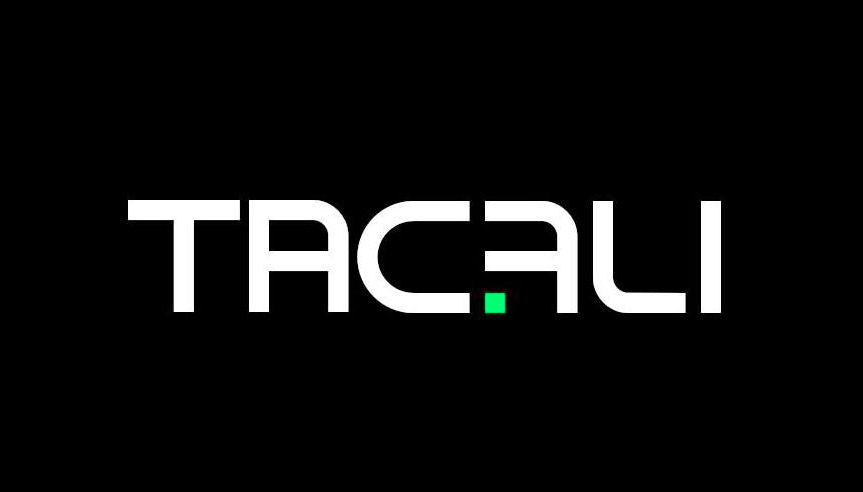

- 👋 Hi, We Are @TacaliInternational
- Twitter https://twitter.com/TacaliCoin
- Web: https://tacali.space
- Github: https://github.com/TacaliInternational
- BitcoinTalk:https://bitcointalk.org/index.php?topic=5365596.0
- You can now add TACA in your Stellar wallet easy ... in your wallet search for TACA and add it to assets 

- What is TacaliCoin [TACA] ?
- TacaliCoin is a stellar token that gives you access to Tacali future services / products.

- https://stellar.expert/explorer/public/asset/TACA-GDEDZ7GXTLA7I5IG7ZAAJW7VTLM7IWQIQM4NEQTZTWDTJRFYACO3TDKC

 What i want is to make a group of companies  that will focus on major industries:

 	• Software
	
	• Research ( Chemicals / Materials / Devices )
	
	• Finance
	
	• Transport
	
	• Logistics
	
	• Manufacturing
	
	• Infrastructure
	
	• Space
	
	• Fast Food
	
	• Farming
	
	• Security
	
	• Luxury & Fashion
	

And an association to help people.

If you buy the token  my recommendation is : Don't sell TacaliCoin , keep it long term.

Business Vision:

Group 1

Group 2

We will expand in other sectors / industries in Group 3 when opportunity comes.

<!---
TacaliInternational/TacaliInternational is a ✨ special ✨ repository because its `README.md` (this file) appears on your GitHub profile.
You can click the Preview link to take a look at your changes.
--->
