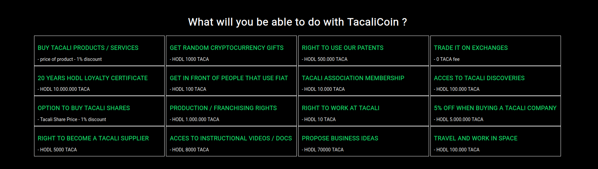
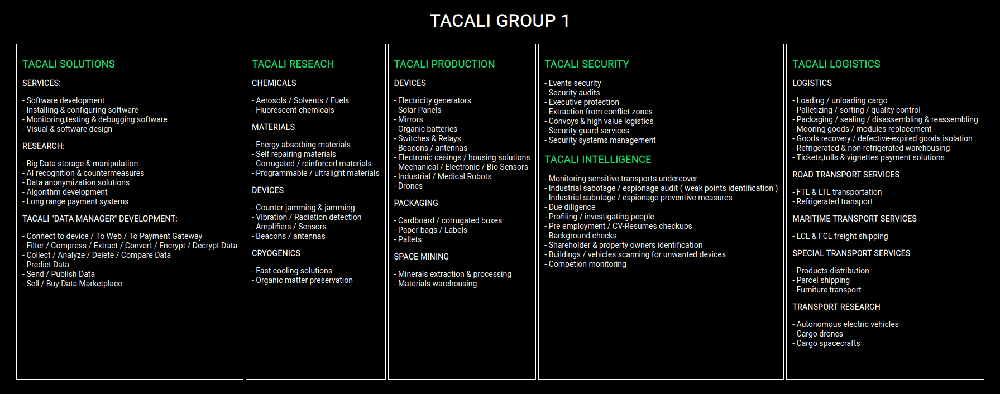
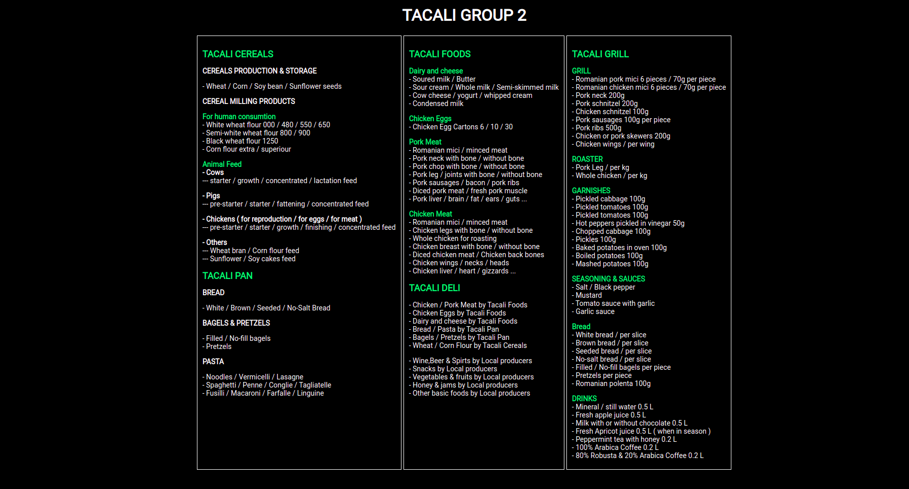

- 👋 Hi, We Are @TacaliInternational
- Web: https://tacali.space
- Github: https://github.com/TacaliInternational
- Telegram Group: https://t.me/joinchat/bBUKU3i2yKs0Mzk0
- BitcoinTalk: https://bitcointalk.org/index.php?topic=5365596
- AltcoinsTalks:https://www.altcoinstalks.com/index.php?topic=237974.0
- Nomics: https://nomics.com/assets/taca-tacalicoin
- Tutorial how to add TacaliCoin (TACA) to Solar wallet : https://www.youtube.com/watch?v=VNybhXnXZY44
- Tutorial how to add TacaliCoin (TACA) to Lobstr wallet: https://www.youtube.com/watch?v=gAoOdKCL0rY
- Trade TACA on Stellar Dex https://developers.stellar.org/docs/glossary/decentralized-exchange/
- Trade TACA on: https://scopuly.com/trade/TACA-XLM/GDEDZ7GXTLA7I5IG7ZAAJW7VTLM7IWQIQM4NEQTZTWDTJRFYACO3TDKC/native

Latest news: https://tacali.space website is online

You can now add TACA in your Stellar wallet easy ... in your wallet search for TACA and add it to assets 

- What is TacaliCoin [TACA] ?
- TacaliCoin is a stellar token that gives you access to Tacali future services / products.

- https://stellar.expert/explorer/public/asset/TACA-GDEDZ7GXTLA7I5IG7ZAAJW7VTLM7IWQIQM4NEQTZTWDTJRFYACO3TDKC

 What i want is to make a group of companies  that will focus on major industries:

 	• Software
	
	• Research ( Chemicals / Materials / Devices )
	
	• Finance
	
	• Transport
	
	• Logistics
	
	• Manufacturing
	
	• Infrastructure
	
	• Space
	
	• Fast Food
	
	• Farming
	
	• Security
	
	• Luxury & Fashion
	

And an association to help people.

If you buy the token  my recommendation is : Don't sell TacaliCoin , keep it long term.

Business Vision:

Group 1

Group 2

We will expand in other sectors / industries in Group 3 when opportunity comes.

<!---
TacaliInternational/TacaliInternational is a ✨ special ✨ repository because its `README.md` (this file) appears on your GitHub profile.
You can click the Preview link to take a look at your changes.
--->
